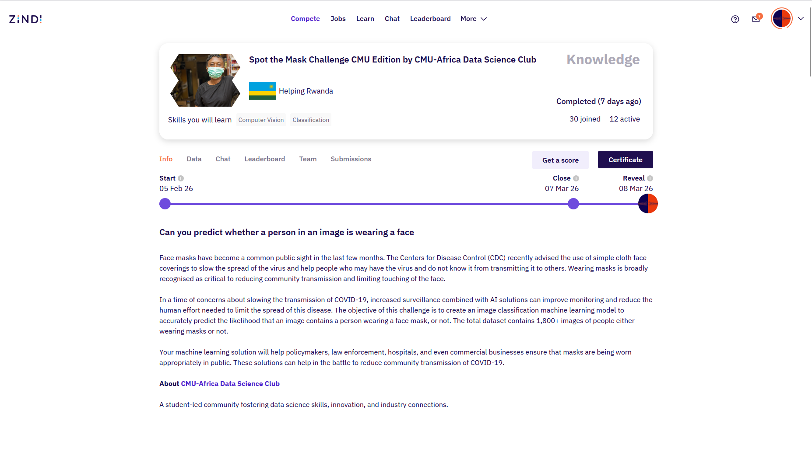

# 😷 Spot the Mask Challenge (CMU Edition)

## 🧠 Face Mask Detection using Computer Vision

This repository presents our approach to the **Spot the Mask Challenge CMU Edition**, organized by the **CMU-Africa Data Science Club** on the [Zindi](https://zindi.africa/competitions/spot-the-mask-challenge-cmu-edition) platform. The task is a **binary image classification** problem aimed at predicting whether a person in an image is **wearing a face mask or not**.

The competition dataset contains **1,800+ images** of individuals with and without face masks. The goal is to build a machine learning model that predicts the **probability that a person in an image is wearing a mask**, helping support automated monitoring systems that can assist public health efforts.

Models are evaluated using **Log Loss**, encouraging well-calibrated probability predictions rather than only hard class assignments.

This repository documents the **computer vision pipeline, model training strategy, and validation framework** developed for the challenge. While competition rules prevent the disclosure of some implementation details required to reproduce leaderboard scores exactly, the methodology presented here is **reproducible and transferable to similar image classification tasks**.

---

## 📊 Problem Overview

Face masks became an important public health tool during the **COVID-19** pandemic to reduce community transmission. Monitoring mask usage in public spaces is challenging to perform manually at scale.

Computer vision models can assist by automatically detecting whether individuals in images are wearing masks. Such systems may support:

* Public health monitoring
* Hospital safety compliance
* Workplace safety enforcement
* Smart surveillance systems

The objective of this challenge is therefore to **predict mask usage directly from image data**.

---

## 🧾 Dataset

The dataset provided in the competition contains:

* **1,800+ labeled images**
* Two classes:

  * `1` → Person wearing a mask
  * `0` → Person not wearing a mask

Each image corresponds to a unique ID used for submission predictions.

Example submission format:

| id                                 | label |
| ---------------------------------- | ----- |
| ttuqxjhrmdqhppfxrbzgyciipwdxcf.jpg | 0.99  |
| qmltykiislwklsklnzhcsrfsqwmaun.jpg | 0.23  |
| lkzeblenqbovljxpucpsufmprjxxqn.jpg | 0.67  |

The **label represents the predicted probability** that the individual in the image is wearing a mask.

---

## 📏 Evaluation Metric

Submissions are evaluated using **Logarithmic Loss (Log Loss)**.

Log Loss measures the **quality of probabilistic predictions**, penalizing models that make confident but incorrect predictions.

Lower Log Loss indicates better performance.

---

## ⚙️ Modeling Approach

Our solution follows a standard **deep learning computer vision pipeline**, including:

### 1️⃣ Data Preparation

* Image loading and preprocessing
* Dataset splitting for validation
* Image augmentation to improve generalization

### 2️⃣ Feature Learning

* Use of **pretrained convolutional neural networks**
* Transfer learning to adapt models to the mask detection task

### 3️⃣ Training Strategy

* Fine-tuning pretrained backbones
* Optimizing classification heads
* Monitoring validation Log Loss

### 4️⃣ Inference

* Generating probability predictions for test images
* Formatting outputs for Zindi submission requirements

---

## 🧰 Tools and Libraries

The implementation primarily relies on:

* **Python**
* **PyTorch**
* **Torchvision**
* **NumPy**
* **Pandas**
* **Scikit-learn**

These tools enable efficient experimentation with deep learning models and evaluation pipelines.

---

## 🌍 Impact

Automated face mask detection systems can support public health infrastructure by:

* Reducing manual monitoring effort
* Scaling compliance checks in crowded spaces
* Supporting policy enforcement during health crises

Machine learning solutions like this can contribute to **safer public environments during infectious disease outbreaks**.

---

If you'd like, I can also help you make a **much stronger GitHub README** by adding:

* **architecture diagram**
* **training pipeline figure**
* **example predictions**
* **model performance table**
* **inference demo**

Those make repos look **much more professional for research, internships, and GitHub portfolios**.
